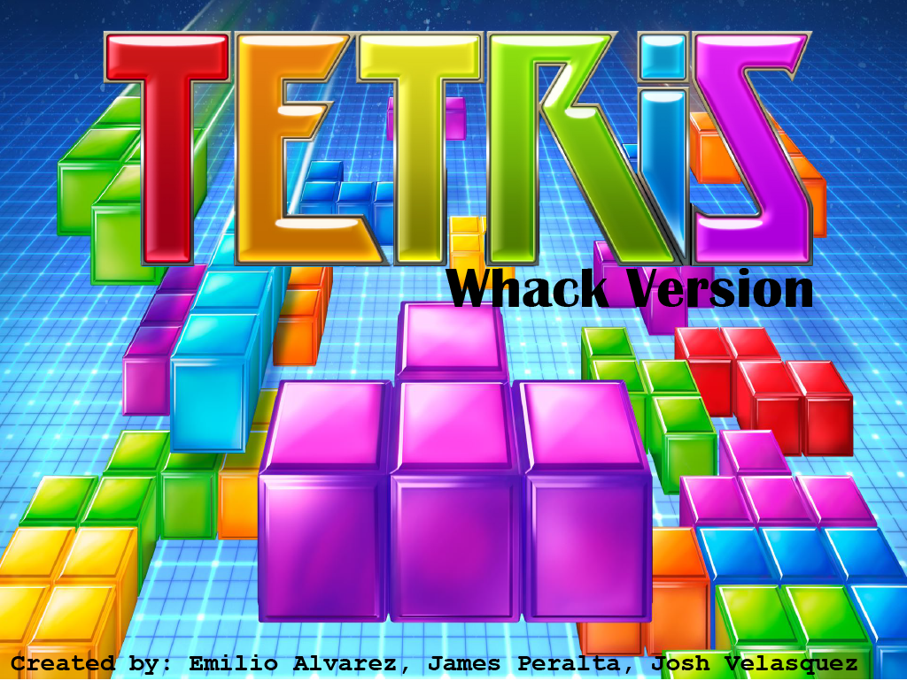

# Tetris: Whack Version

A slightly modified version of Tetris for the Raspbery Pi 2 Model B, written using ARMv7 Assembly.

## Build / Run

NOTE: This requires extra hardware available at the University of Calgary labs for CPSC 359.
Namely, a breakout board connecting a SNES controller and JTAG to the Pi through GPIO.

- Connect the Pi to the breakout board.
- Plug the JTAG USB cable and UART cable to the host.
- Start a GDB server: `JLinkGDBServer`.
- In another terminal, open the project directory, and start the debugger: `arm-none-eabi-gdb`.
- Connect to the GDB server: `target remote localhost:2331`.
- Load code onto the Pi: `load`.
- Run the code: `continue`.

## Authors

- Emilio Alvarez
- James Peralta
- Joshua Velasquez
